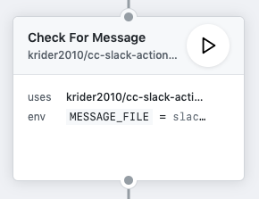
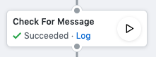
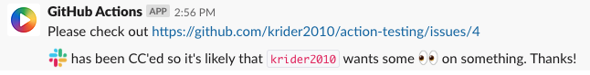

# cc-slack-action

This GitHUb Action parses Issues for _/cc slack_ (case insensitve parsing) and if it is found, creates a payload that can be sent to the [Slack API](https://api.slack.com/methods/chat.postMessage) in the working directory of Actions workflows.

This means that standalone this action is of little use. But if you combine it with another Action (such as [slack_bot_action](https://github.com/krider2010/slack-bot-action)) you will be able to have your workflow ping Slack with the issue or comment URL. It works on issue creation and on any comments and will run whenever an issue or comment occurs.

## Usage

This action can easily be installed via the GitHub Actions Marketplace or by referening it in your Workflow file. It can be setup in either the visual editor or text editor to suit your preferences.

Be sure to use the current latest release (tag) when referencing this Action. It is far safer to lock to a specific version for your Workflow and allows you the choice of when to upgrade.

Here is what it might look like in the text editor:
```
action "Check For Message" {
  uses = "krider2010/cc-slack-action@1.0.0"
  env = {
    MESSAGE_FILE = "message-for-slack.json"
  }
}
```

And here's the visual editor:



If _/cc slack_ is found in the new issue/comment, then this Action also returns a success response as well as creating the payload file. This allows it to be used as a decider on whether to notify slack. If there is no match found, then the Action returns a neutral status. This prevents the next Action running but does not mark the workflow as having errored.

This can be seen here in how the outcomes of runs of the workflow have been reported:



And then when no match was found:


### Output

This Action allows the `MESSAGE_FILE` environment variable to be set to whatever you want it to be. Without any customisation it will default to `slack-message.json`. Knowing this is likely to be necessary for other Actions in the workflow to pick up the file and use it.

## Example Output

If you hook this Action up to something that can post to Slack, you can then see this message looking similar to this (depending on the name and icon you've given the Slack Bot integration):


